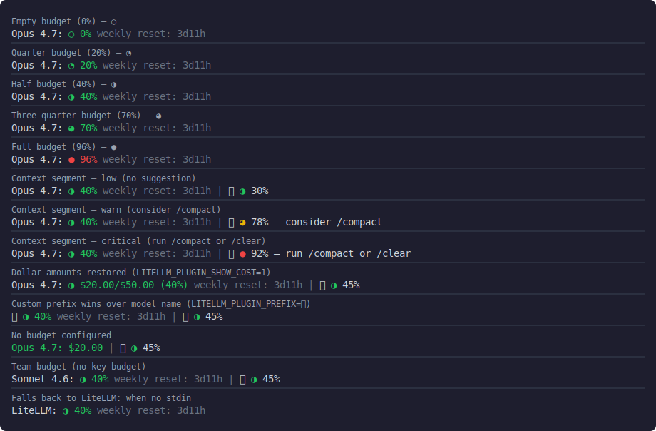

# Claude Code LiteLLM Plugin

A statusline plugin for Claude Code that displays LiteLLM budget information including current spend, max budget, usage percentage, and time until reset.

## Installation

### Quick Install (Recommended)

**macOS / Linux:**

```bash
curl -fsSL https://raw.githubusercontent.com/stvnksslr/claude-code-litellm-plugin/main/install.sh | bash
```

**Windows (PowerShell):**

```powershell
irm https://raw.githubusercontent.com/stvnksslr/claude-code-litellm-plugin/main/install.ps1 | iex
```

The installer will:
- Download the latest release for your OS and architecture
- Install the binary to your PATH
- Configure Claude Code to use the plugin

### Manual Installation

1. Download the latest release from the [releases page](https://github.com/stvnksslr/claude-code-litellm-plugin/releases)

2. Extract and move the binary to a location in your PATH:

```bash
# Example: move to ~/.local/bin
mv claude-code-litellm-plugin ~/.local/bin/
chmod +x ~/.local/bin/claude-code-litellm-plugin
```

3. Add the statusline configuration to `~/.claude/settings.json`:

```json
{
  "statusLine": {
    "type": "command",
    "command": "claude-code-litellm-plugin"
  }
}
```

## Configuration

### Environment Variables

Set the following environment variables (typically in your shell profile like `~/.zshrc` or `~/.bashrc`):

```bash
# LiteLLM Proxy URL (required)
export ANTHROPIC_BASE_URL="https://your-litellm-instance.com"
# or
export LITELLM_PROXY_URL="https://your-litellm-instance.com"

# LiteLLM API Key (required)
export ANTHROPIC_AUTH_TOKEN="your-api-key"
# or
export LITELLM_PROXY_API_KEY="your-api-key"
```

### Claude Code Settings

Add the statusline configuration to your Claude Code settings file:

**For global settings** (`~/.claude/settings.json`):

```json
{
  "statusLine": {
    "type": "command",
    "command": "claude-code-litellm-plugin"
  }
}
```

**For project-specific settings** (`.claude/settings.local.json` in your project):

```json
{
  "statusLine": {
    "type": "command",
    "command": "claude-code-litellm-plugin"
  }
}
```

## Output

The plugin displays budget information in the following format:

```
LiteLLM: $4.69/$40.00 (12%) | weekly reset: 3d1h
```

- Green: 0-74% usage
- Yellow: 75-89% usage
- Red: 90%+ usage

### Beta: Progress Bar with Pace Indicator

Enable the progress bar by setting:

```bash
export LITELLM_PLUGIN_BETA_FEATURES=1
```

This appends a progress bar to the standard status line shown above. The bar has two components:

- **Fill** (`█`) shows how much of the budget has been spent. Color follows the same green/yellow/red thresholds as the text.
- **Pace marker** (`│`) shows how far through the budget period you are. It lets you see at a glance whether you're spending ahead of or behind pace.



## Environment Variable Priority

The plugin checks environment variables in the following order:

**Base URL:**

1. `LITELLM_PROXY_URL`
2. `ANTHROPIC_BASE_URL`

**API Key:**

1. `LITELLM_PROXY_API_KEY`
2. `ANTHROPIC_AUTH_TOKEN`

## Troubleshooting

If the statusline shows an error:

- `No API key` - Set either `ANTHROPIC_AUTH_TOKEN` or `LITELLM_PROXY_API_KEY`
- `Auth error` - Check your API key is valid
- `Connection error` - Check your base URL and network connection
- `Error` - Generic error, check logs for details

## Development

Run tests:

```bash
go test -v
```

Run locally:

```bash
go run main.go
```
