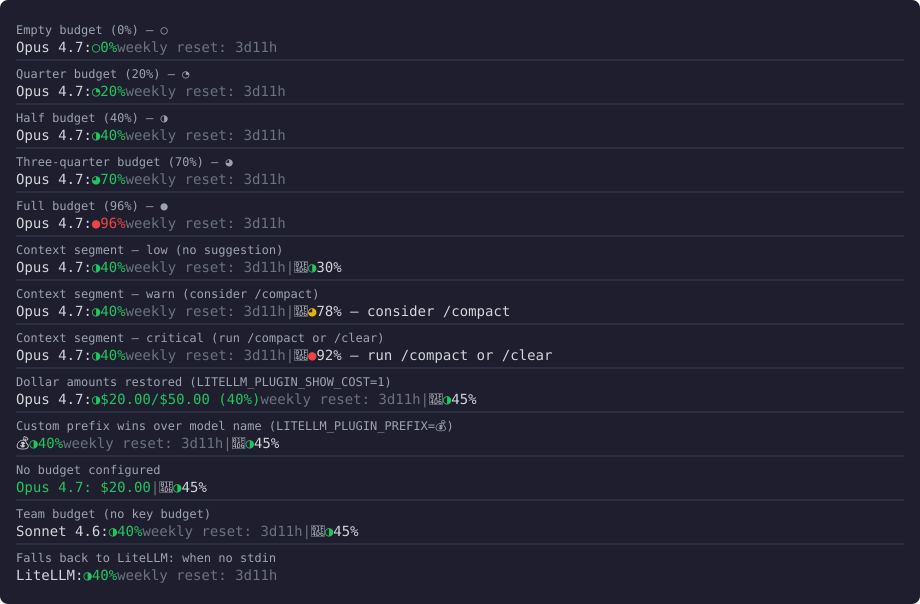

# Claude Code LiteLLM Plugin

A statusline plugin for Claude Code that displays LiteLLM budget information including current spend, max budget, usage percentage, and time until reset.

## Installation

### Quick Install (Recommended)

**macOS / Linux:**

```bash
curl -fsSL https://raw.githubusercontent.com/stvnksslr/claude-code-litellm-plugin/main/install.sh | bash
```

**Windows (PowerShell):**

```powershell
irm https://raw.githubusercontent.com/stvnksslr/claude-code-litellm-plugin/main/install.ps1 | iex
```

The installer will:
- Download the latest release for your OS and architecture
- Install the binary to your PATH
- Configure Claude Code to use the plugin

### Manual Installation

1. Download the latest release from the [releases page](https://github.com/stvnksslr/claude-code-litellm-plugin/releases)

2. Extract and move the binary to a location in your PATH:

```bash
# Example: move to ~/.local/bin
mv claude-code-litellm-plugin ~/.local/bin/
chmod +x ~/.local/bin/claude-code-litellm-plugin
```

3. Add the statusline configuration to `~/.claude/settings.json`:

```json
{
  "statusLine": {
    "type": "command",
    "command": "claude-code-litellm-plugin"
  }
}
```

## Editor Plugins

Optional status bar widgets for VS Code and IntelliJ — they spawn the same
`claude-code-litellm-plugin` binary (with `--json`) and render the budget info
in the editor's status bar. The binary must already be installed and on `PATH`
(or at `~/.local/bin/claude-code-litellm-plugin`).

### VS Code

Download the latest `claude-code-litellm-*.vsix` from the
[releases page](https://github.com/stvnksslr/claude-code-litellm-plugin/releases),
then:

```bash
code --install-extension path/to/claude-code-litellm-*.vsix --force
```

Reload the window (`Cmd/Ctrl+Shift+P` → “Developer: Reload Window”).

### IntelliJ

Download the latest `claude-code-litellm-intellij-*.zip` from the
[releases page](https://github.com/stvnksslr/claude-code-litellm-plugin/releases),
then:

`Settings` → `Plugins` → ⚙ → `Install Plugin from Disk…` → select the zip → restart.

### Marketplace publishing

> **TODO:** Both editor plugins are built locally and attached to GitHub
> releases for now. They are not yet published to their respective marketplaces
> (VS Code Marketplace, JetBrains Marketplace). Publishing will be added once
> the plugins are stabilized and the publisher accounts are provisioned.

## Configuration

### Environment Variables

Set the following environment variables (typically in your shell profile like `~/.zshrc` or `~/.bashrc`):

```bash
# LiteLLM Proxy URL (required)
export ANTHROPIC_BASE_URL="https://your-litellm-instance.com"
# or
export LITELLM_PROXY_URL="https://your-litellm-instance.com"

# LiteLLM API Key (required)
export ANTHROPIC_AUTH_TOKEN="your-api-key"
# or
export LITELLM_PROXY_API_KEY="your-api-key"
```

**SSO / gateway auth (no API key):** If Claude Code signs in through a LiteLLM gateway (`forceLoginMethod: "gateway"` managed setting + `/login` device flow, see the [LiteLLM gateway tutorial](https://docs.litellm.ai/docs/tutorials/claude_code_gateway)), the plugin can use the LiteLLM token Claude Code stores (`enterpriseGateway`) instead of an API key. It is only consulted when neither `LITELLM_PROXY_API_KEY` nor `ANTHROPIC_AUTH_TOKEN` is set, and budgets are read from `GET /user/info` — the gateway token is not a database key, so `/key/info` does not apply to it.

The token is only sent to the gateway that issued it:

- If `LITELLM_PROXY_URL` / `ANTHROPIC_BASE_URL` is set, its scheme, host, and port must match the gateway URL stored with the token; otherwise the token is withheld (`No API key`). If neither is set, the stored gateway URL is used.
- The gateway must use HTTPS (plain HTTP is only allowed to `localhost` / loopback).
- Claude Code's Anthropic OAuth token (`claudeAiOauth`) is never used — it is an Anthropic credential, not a LiteLLM one.

The plugin checks `~/.claude/.credentials.json` first. On macOS, Claude Code keeps credentials in the login Keychain (service `Claude Code-credentials`) instead, so the plugin then reads that item with `/usr/bin/security find-generic-password`. `LITELLM_PLUGIN_CLAUDE_CREDENTIALS_FILE` points at a specific file and disables the Keychain lookup.

> **Keychain prompt:** macOS may ask whether `security` can access the `Claude Code-credentials` item. **Allow** grants access once. **Always Allow** adds `/usr/bin/security` to the item's access list, which lets *any* process running as you read the item through `security` without a prompt. Prefer **Allow**, or set `LITELLM_PROXY_API_KEY` instead if the repeated prompt is a problem. To revoke an earlier "Always Allow", open Keychain Access → `Claude Code-credentials` → Get Info → Access Control and remove `security`.

Expired tokens are skipped — a gateway token lapses after ~24 hours (LiteLLM issues no refresh token), so run `/login` in Claude Code again when that happens. With multiple teams, the statusline shows the first team on your LiteLLM user record — the team LiteLLM scopes the gateway token to.

### Claude Code Settings

Add the statusline configuration to your Claude Code settings file:

**For global settings** (`~/.claude/settings.json`):

```json
{
  "statusLine": {
    "type": "command",
    "command": "claude-code-litellm-plugin"
  }
}
```

**For project-specific settings** (`.claude/settings.local.json` in your project):

```json
{
  "statusLine": {
    "type": "command",
    "command": "claude-code-litellm-plugin"
  }
}
```

## Output

The plugin displays the active model, budget usage, and context-window pressure:

```
Opus 4.7: ○ 12% weekly reset: 3d1h | 📖 ◑ 45%
```

- **Prefix** is the model display name from Claude Code's stdin (falls back to `LiteLLM:` when stdin is unavailable). Override with `LITELLM_PLUGIN_PREFIX`.
- **Circle gauge** fills clockwise as usage grows: `○` (empty) · `◔` (<30%) · `◑` (<60%) · `◕` (<85%) · `●` (full).
- **Color** thresholds for the budget circle: green `< 75%`, yellow `75–89%`, red `90%+`.
- **Reset countdown** shows time until the budget rolls over.
- **Context segment (`📖 ●`)** reports the current context-window usage from Claude Code. Color thresholds: green `< 70%`, yellow `70–84%`, red `85%+`. Warn and critical bands append `— consider /compact` and `— run /compact or /clear` respectively. The segment is hidden when stdin doesn't include context data (e.g. before the first API call in a session).



### Restoring dollar amounts

Dollar amounts are hidden by default. To show `$spend/$budget (pct%)` instead of just the percentage:

```bash
export LITELLM_PLUGIN_SHOW_COST=1
```

## Environment Variable Priority

The plugin checks environment variables in the following order:

**Base URL:**

1. `LITELLM_PROXY_URL`
2. `ANTHROPIC_BASE_URL`

**API Key:**

1. `LITELLM_PROXY_API_KEY`
2. `ANTHROPIC_AUTH_TOKEN`
3. Claude Code credential store — the LiteLLM gateway SSO token (`enterpriseGateway`) when Claude Code is signed in through a LiteLLM gateway (macOS Keychain, else `~/.claude/.credentials.json`; override with `LITELLM_PLUGIN_CLAUDE_CREDENTIALS_FILE`) — used only when both env vars are unset, and only sent to the HTTPS gateway that issued it

## Troubleshooting

If the statusline shows an error:

- `No API key` - Set either `ANTHROPIC_AUTH_TOKEN` or `LITELLM_PROXY_API_KEY`, or sign in to Claude Code through a LiteLLM gateway (`/login`). With gateway SSO, also check the token hasn't expired and that `LITELLM_PROXY_URL` / `ANTHROPIC_BASE_URL` (if set) points at the same HTTPS host as the gateway
- `no budget configured` - Your LiteLLM user (or the gateway token's scoped team) has no `max_budget`; set one in LiteLLM to see budget info
- `Auth error` - Check your API key is valid; with gateway SSO the token may have lapsed — run `/login` in Claude Code again
- `Connection error` - Check your base URL and network connection
- `Error` - Generic error, check logs for details

## Development

This repo uses [mise](https://mise.jdx.dev) to manage the Go, Node, and Java
toolchains (see `mise.toml`). After cloning:

```bash
mise install   # installs go, node, java
```

Common tasks:

```bash
mise run build            # statusline binary
mise run vscode:build     # VS Code .vsix
mise run intellij:build   # IntelliJ .zip
mise run build:all        # all three

mise run test             # Go tests (regenerates examples.svg)
mise run lint             # go fmt + tidy + golangci-lint
```

Run the statusline locally:

```bash
go run main.go
```
